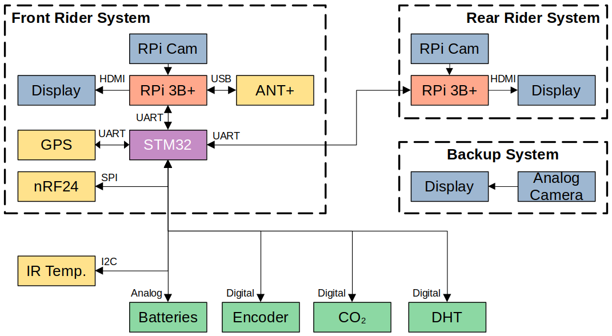

# TITAN Video System 2026

_One more swing!_

This is the code and hardware that is used to drive the electronics aboard TITAN for the "drive-by-video" system to be hopefully used for the World Human Powered Speed Challenge 2026. **This is heavily based on - and should really be considered a revision of the previous version I made in [2022](https://savobajic.ca/projects/extracurricular/titan-2022/).**

This code is spread across two types of devices, an STM32 microcontroller and Raspberry Pis (RPi) Model 3's. Each rider has an RPi for a total of two units, while there is only one STM32 needed for the vehicle. The STM32 is primarily responsible for collecting vehicle data and passing it to the RPis when requested while the RPis are responsible for displaying the video feed from the RPi Cameras used (hence why each rider needs their own) with an overlay of data collected inside the vehicle. This overlay is tailored to each rider.

There is an additional redundant video system for the front rider based on analog video to minimize potential failure points. This system was entirely off the shelf except for the power regulator, and was entirely disconnected from the remainder of TITAN's electronics to prevent any failure cascade affecting it.

## Folders

The repository is split into folders based on function.

Folder | Purpose
------ | -------
`hardware` | Hardware files for our circuit boards
`firmware` | Code for the embedded systems (STM32)
`vision` | Code used to operate the video system

## Hardware

The hardware for TITAN was all designed in [KiCad](https://www.kicad.org/) there are a few boards designed for TITAN with a `readme.md` explaining their purposes. Below is a block diagram of the TITAN system.

## Microcontroller Code

This is the code prepared for the microcontroller on TITAN. It contains the overall program for TITAN, as well as potentially some other unit tests or variants.

## Raspberry Pi Code

These are responsible for putting video feeds from the outside on the displays for the riders to see from inside. These are overlaid with information collected about TITAN. One of the RPi's has an ANT+ USB module used to collect data from the heart rate monitor and power pedals each rider has and feed it to the STM32 to pass onto the rest of the system.

**The program for running the video feed is run as a separate process to the overlay**, this way if there is a hardware malfunction for the overlay (e.g. the STM32 freezes) then the video feed is uninterrupted for the riders.
