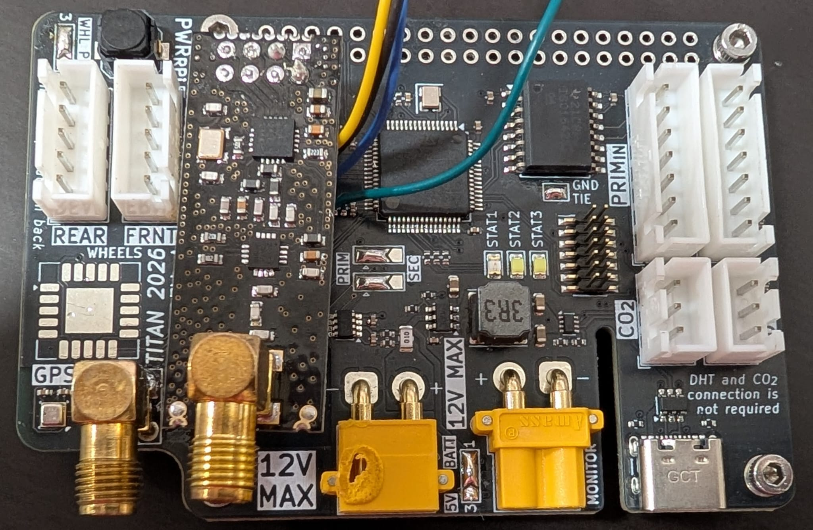
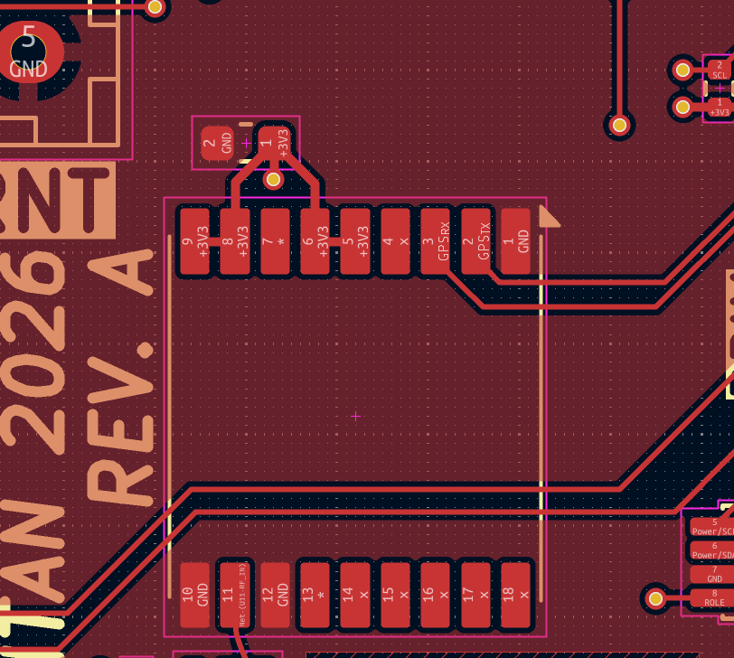
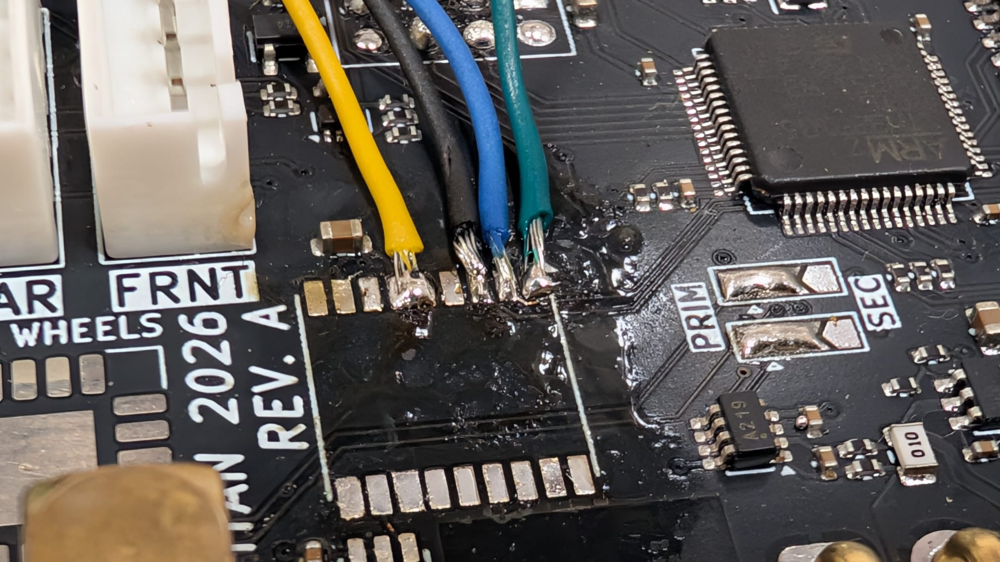

# Configuring and Fixing TITAN 2026 Rev. A Boards

Before use these board will need the attention of a soldering iron to prepare them for proper operation. It is assumed that you will have access to a soldering iron, a hot air rework station, solder _(preferably lead-free)_, solder flux, solder wick, and tweazers.

## Bill of Materials

The boards weren't fully assembled by the vendor so far, so the following parts are needed to complete the board and complete any fixes. _These numbers are all per board._

- 1 unit - 40-pin (2 rows x 20) 0.1" female pin header, to connect to the RPi.
- 4 sets - 2.5M spacers to hold the HAT to the RPi.
  - Preferably plastic to avoid shorts or damaging the boards.
  - A perfect fit would need 11&nbsp;mm tall spacers but those are rare, so the more common 10&nbsp;mm can be used instead without issue.

These parts are optional, depending on if certain fixes or "upgrades" are desired.

- 1 unit - SCD-41 CO2 sensor. _The SCD-40 can be used too if necessary._
- 1 unit - Replacement UART 3.3&nbsp;V GPS module. The "Ultimate GPS" from 2022 can be used or most other GPS modules readily found online. _Ideally find one with an SMA connector but adaptors exist._
- 1 unit - nRF24L01+LNA module with an SMA connector, to enable telemetry. There should plenty at the workshop, otherwise they're readily available and pretty standardized online.

## Completing the Board

Although the boards were largely assembled by a third party, some pieces were ommitted for various reasons _($$$)_ and need to be hand installed on **ALL** the boards. These parts should be installed in the order below.

1. Solder the 40-pin header for the RPi to the bottom of the board so the HAT may be seated atop the RPi.
2. Proceed to [complete the solder configurations](#configuration-via-solder-jumpers) needed
3. Complete any desired bodges/upgrades listed below
4. Once all soldering is completed to a board, use the spacers to firmly mount the HAT to the RPi before installation into TITAN.

## Configuration via Solder Jumpers

On the TITAN board there are a three clusters of solder jumpers that need to be properly set for the boards to work.

>[!NOTE]
> None of these jumpers should be left open when using a board. No damage will occur if they are left open, but it will certainly lead to degraded performance since these route power or data around the system needed for things to work properly.

### Wheel Power Selection

The first one in the north west, by the power button is for setting the power supply to the wheel boards. **Bridge this one so that `3` is connected to the middle on ALL boards.** This was for development to see if the wheels can reliably operate at 3.3&nbsp;V or if 5&nbsp;V was needed. _If this is incorrectly connected to `5` instead the system will still work, but some damage may happen to the brake temperature sensors with prolonged operation._

### Board Role Selection

Moving toward the microcontroller there are two jumpers that need to be set together to put the board into a primary or secondary role. If the board is meant to function as a primary board connect the pads by `PRIM` to the center, otherwise connect the ones by `SEC`. This will direct to which microcontroller the onboard power monitor connects to so the battery level can be monitored. Connecting the two center pads to different ends will not cause catastrophic failures, however bridging `PRIM` to `SEC` through the middle will cause TITAN systems to fail.

### Monitor Power Selection

The final _mandatory_ bridge is between the two XT-30 connectors. This selects what voltage to apply to the monitor XT-30 between the battery voltage or the onboard regulated 5&nbsp;V rail. Solder this based on the selection of battery and monitor. _I would suggest to use the battery voltage if possible, otherwise the RPi and monitor will fight for the 15&nbsp;W available from the regulator._

### Inter Board Ground Connection

Lastly there is a bridge labelled `GND TIE` near the inter board connectors, **this one can be left open with no drawbacks**. It connects the GND of the two baords together taht would otherwise be totally isolated - which enables electrical probing between two boards, but does slightly undermine some of the protection that the isolation chip offers. _This bridge has no effect on secondary boards._

The image below shows a completed TITAN board with the solder jumpers configured for primary operation, with battery power supplied directly to the monitor, and its ground connected to the secondary. _Please ignore the damage to the battery XT-30 from careless soldering!_

## GPS Issue and Replacement Fix

The only issue the Rev. A board carries is that the GPS antenna circuit doesn't work, rendering the onboard GPS module useless. Leaving the GPS module present will not negatively impact the system, it will simply not provide any useful GPS data to use.

The faulty GPS system can be replaced with a functional off board module with bit of work:

1. Remove the useless GPS module (module with a QR code sticker on top, near the GPS antenna). Be careful to not deform the plastic wheel connectors nearby.
2. Solder wires to the functional pads for the GPS module to connect the offboard module. **`GPS_TX` connects to the TX output of the GPS** module, `GPS_RX` to RX of the GPS.

The connections made to the GPS footprint are shown labelled below.

The image below shows the final result with wires soldered on. Yellow wire for power, black for GPS RX, blue for GPS TX, and green for ground _(don't question the choice of colours!)_

## Upgrades, Upgrades

There are some optional things that can be done to improve or make full use of TITAN. TITAN's firmware is designed to check for these and adjust automatically so if these are absent then TITAN will continue to operate without issue.

>[!IMPORTANT]
> These upgrades will only be used if the board is acting as a primary, so there is no need to perform these on boards destined to serve as secondaries.

### SCD-4x CO2 Sensor

This is a low-power digital CO2 sensor that has a footprint allocated on the PCB by the GPS antenna but was ommited from assembly due to its cost and the fact that we already have a decent sensor with the MH-Z19B that covers the same range - albeit power hungry.

The SCD-41 should be used since it has a higher range (400&nbsp;to&nbsp;5000&nbsp;ppm), but the SCD-40 (only 400&nbsp;to&nbsp;2000&nbsp;ppm) is pin compatible in a pinch and the code will retrieve data all the same regardless. The SCD-40 is likely to be overwhelmed during a true run based on previous data showing conditions exceeding 2000&nbsp;ppm quickly into a run.

Placing it on the board is a standard SMT reflow operation. The decoupling capacitor it requires is already populated so only the sensor needs to be placed in the proper orientation.

### nRF24 Radio Installation

Soldering an nRF24L01 module to the empty footprint between the microcontroller and the power button for the RPi will allow the board to broadcast telemetry to a downlink in the chase vehicle or elsewhere. This is a simple through hole soldering operation, simply seat the radio so the antenna connector points the same way as the GPS antenna and solder it down.

>[!CAUTION]
> The nRF24 module will obstruct the GPS module region of the PCB, so do any work on the GPS system prior to installing an nRF24 radio module. This can be seen in the image of the completed solder jumpers.
